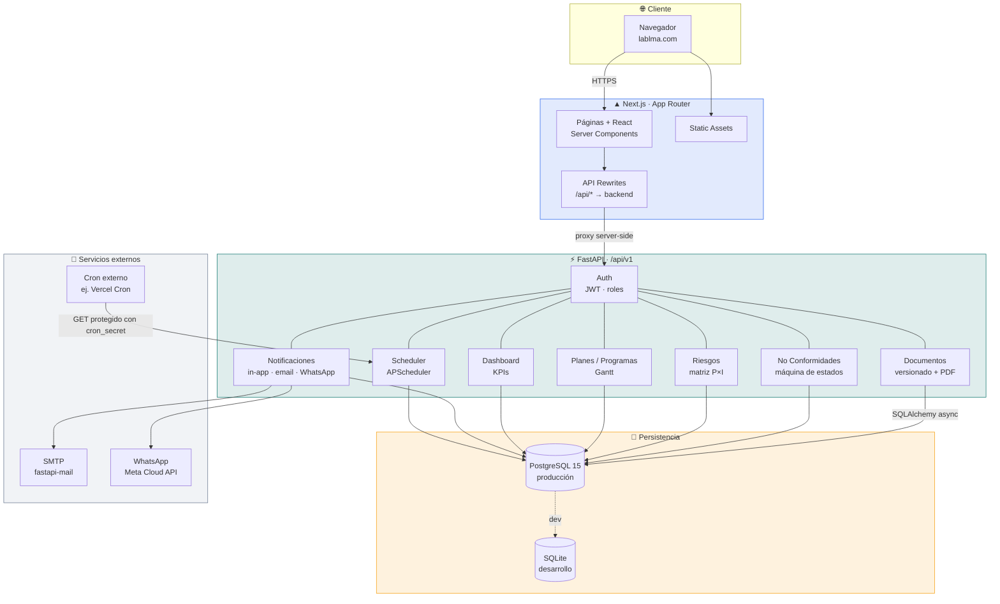
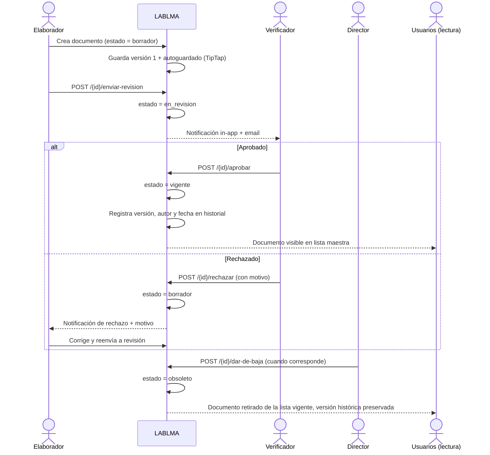
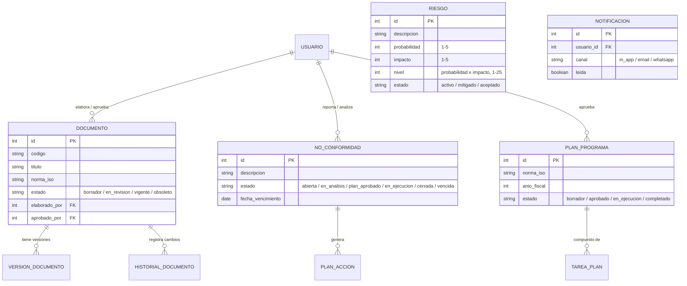
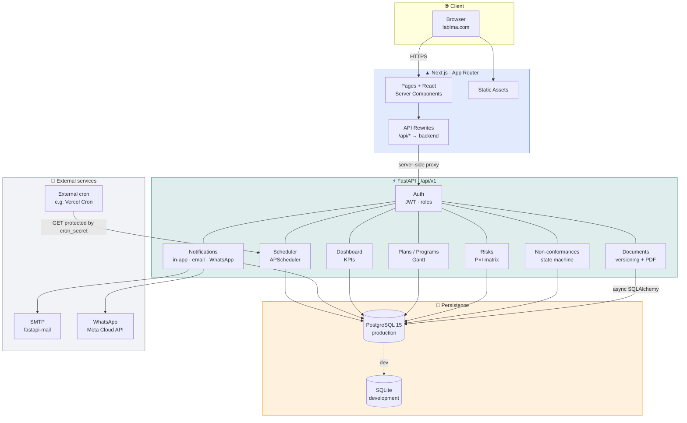
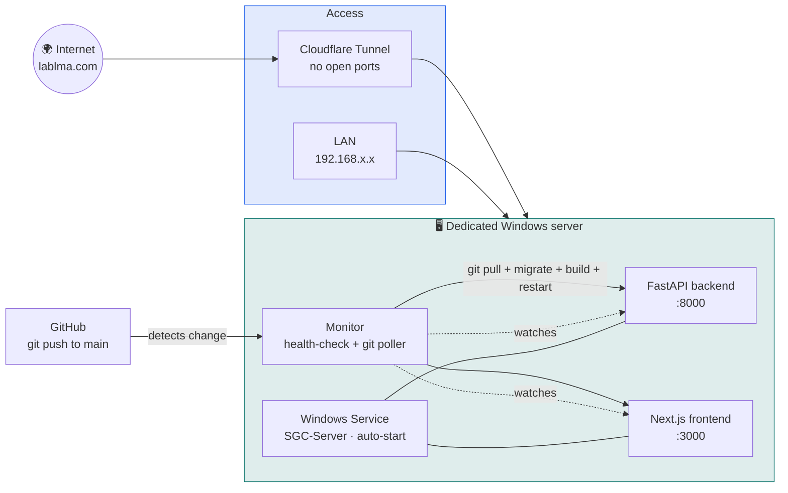
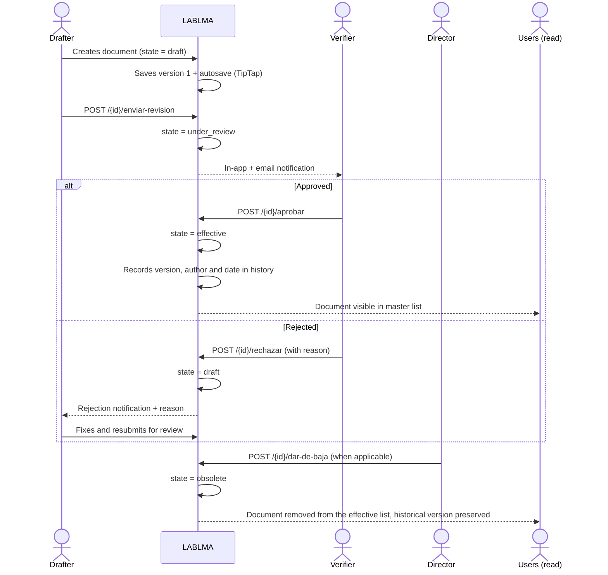
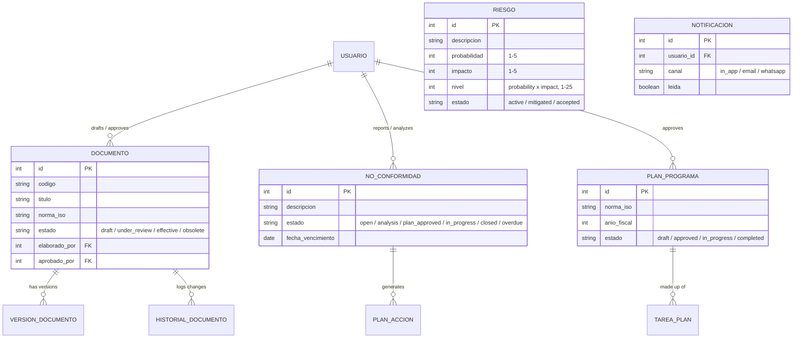

<p align="center">
  
</p>

<p align="center">
  
</p>

<p align="center">
  
  
  
  
  
  
</p>

<p align="center">
  
</p>

<p align="center">
  <a href="#español"><b>🇪🇸 Español</b></a> &nbsp;·&nbsp; <a href="#english"><b>🇬🇧 English</b></a>
</p>

---

<a name="español"></a>
## 🇪🇸 Español

### 📑 Tabla de contenidos

- [¿Qué es LABLMA?](#qué-es-lablma)
- [Arquitectura](#arquitectura)
- [Flujo de aprobación de un documento](#flujo-de-aprobación-de-un-documento)
- [Modelo de datos](#modelo-de-datos)
- [Características principales](#características-principales)
- [Stack tecnológico](#stack-tecnológico)
- [Estructura del proyecto](#estructura-del-proyecto)
- [API REST](#api-rest)
- [Infraestructura de producción](#infraestructura-de-producción)
- [Estado del proyecto y roadmap](#estado-del-proyecto-y-roadmap)
- [Licencia](#licencia)
- [Autor](#autor)

---

### ¿Qué es LABLMA?

**LABLMA** es un Sistema de Gestión de Calidad (SGC) web full-stack que digitaliza, de punta a punta, los procesos que exigen las normas **ISO 9001** (gestión de calidad), **ISO 17025** (competencia de laboratorios de ensayo y calibración), **ISO 14001** (gestión ambiental) e **ISO 45001** (seguridad y salud en el trabajo).

En la mayoría de las PYMES, laboratorios de ensayo/calibración y organismos de certificación, el SGC vive repartido en carpetas compartidas, hojas de cálculo y correos sueltos: listas maestras de documentos en Excel, no conformidades registradas en Word, matrices de riesgo que nadie actualiza y planes de acción sin trazabilidad de quién aprobó qué y cuándo. Eso es exactamente lo que rompe cualquier auditoría externa seria.

LABLMA reemplaza ese archipiélago de archivos por una única aplicación con:

- **Trazabilidad real** — cada documento, no conformidad, riesgo y plan queda vinculado a un usuario, un rol y una marca de tiempo, con historial de versiones y de cambios de estado.
- **Flujos de aprobación auditable** — nada pasa de borrador a vigente sin pasar por los roles correspondientes; queda registrado quién aprobó, quién rechazó y por qué.
- **Reporting ejecutivo en vivo** — un dashboard con KPIs, gráficos y alertas de vencimiento, en lugar de un informe manual mensual armado a mano.
- **Notificaciones multicanal** — el sistema avisa solo, por dentro de la app, por email y por WhatsApp, cuando algo requiere atención.

No es un producto genérico de gestión de proyectos con la etiqueta "calidad" pegada encima: los estados de negocio, los roles, las normas soportadas y las plantillas de notificación están modelados específicamente sobre el ciclo de vida que exige un SGC certificable. Y no es un prototipo de portfolio — **corre en producción real** en `lablma.com`, sobre infraestructura propia con auto-deploy, sirviendo a una organización que hoy gestiona su calidad ahí en vivo.

### Arquitectura

LABLMA sigue una arquitectura de tres capas clásica, con **Next.js** como frontend que también actúa de proxy hacia la API, un backend **FastAPI** modular por dominio de negocio, y **PostgreSQL** como base de datos productiva (con SQLite como alternativa liviana para desarrollo). El sistema de notificaciones y el scheduler de tareas viven dentro del propio backend, sin colas ni brokers externos.



> El frontend nunca llama directo a `lablma-api` desde el navegador: todas las peticiones pasan por `/api/*` en Next.js, que actúa de proxy server-side hacia FastAPI. Esto evita exponer el backend en un dominio/puerto distinto y simplifica CORS y cookies de sesión.

**Infraestructura de producción (servidor propio, sin PaaS):**


### Flujo de aprobación de un documento

El corazón del control documental es este ciclo de vida: nada llega a `vigente` sin pasar por revisión y aprobación explícita, y cada transición queda registrada en el historial del documento.



### Modelo de datos

El dominio se apoya en 10 modelos SQLAlchemy. El siguiente diagrama resume las entidades centrales y sus relaciones:



> Esquema simplificado a partir de `backend/app/models/`. Los estados de cada entidad son los reales del código (ver máquinas de estado abajo), no una aproximación genérica.

#### Máquinas de estado de negocio

```
Documento:       borrador → en_revision → vigente → obsoleto
No conformidad:  abierta → en_analisis → plan_aprobado → en_ejecucion → cerrada / vencida
Plan de acción:  pendiente → en_curso → completada
Riesgo:          activo → mitigado → aceptado
Plan/Programa:   borrador → aprobado → en_ejecucion → completado
```

### Características principales

**📄 Control documental**
- Ciclo de vida completo `borrador → en_revisión → vigente → obsoleto`, con lista maestra de documentos y código/norma ISO asociada.
- Editor WYSIWYG (**TipTap**) con tablas, imágenes, links, autoguardado e historial de cambios.
- Control de versiones: cada aprobación genera una nueva versión trazable, con autor y fecha.
- Flujo de aprobación **multi-rol**: envío a revisión, aprobación, rechazo con motivo, y baja a obsoleto.
- Generación de **PDF** de documentos y reportes mediante WeasyPrint + plantillas Jinja2.

**⚠️ No conformidades (NC)**
- Máquina de estados `abierta → en_análisis → plan_aprobado → en_ejecución → cerrada / vencida`.
- Acciones correctivas vinculadas (`planes_accion`), con seguimiento independiente de progreso.
- Alertas automáticas de vencimiento disparadas por el scheduler.

**📊 Matriz de riesgos**
- Evaluación **probabilidad (1-5) × impacto (1-5) = nivel (1-25)**.
- Mapa de calor visual para priorización inmediata.
- Planes de tratamiento y clasificación automática por criticidad.

**🗓️ Planes y programas**
- Vinculados a norma ISO específica y año fiscal.
- Vista tipo **Gantt**: tareas, responsables, fechas y progreso 0-100%.
- Aprobación multi-rol antes de pasar a ejecución.

**📈 Dashboard ejecutivo**
- KPIs en tiempo real, gráficos de torta (NC por tipo) y de barras (documentos por estado) con **Recharts**.
- Alertas de próximos vencimientos y auto-refresh sin intervención manual.

**🔔 Notificaciones multicanal**
- **In-app**: campana con contador de no leídas.
- **Email**: SMTP vía `fastapi-mail`.
- **WhatsApp**: Meta Cloud API, con plantillas dedicadas para NC y documentos.
- Se disparan automáticamente al asignar una NC, aprobar un documento o ante vencimientos próximos.

**👥 Usuarios y roles**
- 6 roles con matriz de permisos granular: `admin`, `director`, `responsable`, `verificador`, `elaborador`, `consultor`.
- CRUD de usuarios restringido a administradores.
- Jerarquía de roles: `admin` > `director` > `responsable` > `verificador` > `elaborador` > `consultor`.

**⏱️ Automatización**
- Tareas programadas (recordatorios de vencimiento, limpieza) con **APScheduler**.
- Endpoint protegido (`cron_secret`) para disparar el scheduler desde un cron externo (p. ej. Vercel Cron), útil cuando el proceso Python no corre 24/7 en el mismo host.

**🖥️ Infraestructura autogestionada**
- Stack propio en PowerShell: wizard de instalación, servicio de Windows con arranque automático, monitor de salud con auto-restart.
- **Auto-deploy**: al hacer `git push`, un monitor en el servidor detecta el cambio, hace `git pull`, corre migraciones, reconstruye el frontend y reinicia los servicios — sin intervención manual.
- **Cloudflare Tunnel** para exponer el sistema a internet sin abrir puertos en el router.

### Stack tecnológico

| Capa | Tecnología | Detalle |
|---|---|---|
| 🎨 Frontend | **Next.js 14** (App Router) + **TypeScript** | React Server Components, rutas agrupadas `(auth)` / `(dashboard)` |
| 💅 Estilos | **Tailwind CSS** + class-variance-authority | Sistema de diseño utilitario |
| ✏️ Editor enriquecido | **TipTap** | Tablas, imágenes, links, autoguardado |
| 📊 Gráficos | **Recharts** | Torta y barras en el dashboard |
| 🎯 Iconos | Lucide React | Set de iconos consistente |
| 🌐 HTTP (frontend) | Axios | Cliente hacia `/api/v1` |
| ⚡ Backend | **FastAPI** + **Python 3.12** | API async bajo `/api/v1` |
| 🗃️ ORM | **SQLAlchemy 2.0** (async) + **Alembic** | Migraciones versionadas |
| ✅ Validación | **Pydantic** + Pydantic Settings | Esquemas request/response |
| 🐘 Base de datos | **PostgreSQL 15** (producción) / SQLite + aiosqlite (desarrollo) | — |
| 🔐 Autenticación | **JWT (HS256)** vía `python-jose` + `bcrypt`/`passlib` | Expiración configurable (default 8h) |
| 📑 PDF | **WeasyPrint** + Jinja2 | Documentos y reportes |
| 📬 Notificaciones | SMTP (`fastapi-mail`) + **WhatsApp Cloud API** (Meta) | Multicanal |
| 🌐 HTTP (backend) | httpx | Llamadas salientes |
| ⏰ Tareas programadas | **APScheduler** | Recordatorios y limpieza |
| 🐳 Contenedores | Docker + Docker Compose | Alternativa Linux/dev |
| 🛠️ Infraestructura | Scripts **PowerShell** (setup, deploy, sync, monitor, tunnel) + `cloudflared` + Windows Service | Producción autogestionada |

### Estructura del proyecto

```mermaid
graph TD
    Root["LABLMA/"] --> FE["frontend/<br/>Next.js 14 + TypeScript"]
    Root --> BE["backend/<br/>FastAPI"]
    Root --> Scripts["scripts/<br/>infraestructura"]
    Root --> Boot["boot.ps1 / start.ps1<br/>entry points unificados"]
    Root --> Compose["docker-compose.yml"]

    FE --> Src["src/"]
    Src --> App["app/<br/>(auth) · (dashboard)"]
    Src --> Comp["components/<br/>UI + layout + por módulo"]
    Src --> Hooks["hooks/<br/>useAuth, useDocumentos..."]
    Src --> Lib["lib/<br/>api.ts · auth.ts · utils.ts"]
    Src --> Types["types/<br/>interfaces TS compartidas"]

    BE --> Alembic["alembic/<br/>migraciones"]
    BE --> AppBE["app/"]
    AppBE --> Auth["auth/<br/>router + JWT"]
    AppBE --> Models["models/<br/>10 modelos SQLAlchemy"]
    AppBE --> Schemas["schemas/<br/>Pydantic"]
    AppBE --> Routers["routers/<br/>8 routers · ~40 endpoints"]
    AppBE --> Services["services/<br/>email · whatsapp · pdf · scheduler"]
    AppBE --> Templates["templates/pdf/<br/>Jinja2"]
    AppBE --> Seed["seed.py<br/>datos demo"]

    Scripts --> Infra["infra/"]
    Infra --> Setup["setup.ps1 · wizard instalación"]
    Infra --> Network["network.ps1 · IP LAN + firewall"]
    Infra --> Deploy["deploy.ps1 · pipeline"]
    Infra --> Sync["sync.ps1 · comandos Git"]
    Infra --> TunnelPs["tunnel.ps1 · Cloudflare"]
    Infra --> MonitorPs["monitor.ps1 · health + git poller"]
    Infra --> Webhook["webhook-server.py"]

    style Root fill:#0F766E33,stroke:#0F766E
    style FE fill:#2563EB22,stroke:#2563EB
    style BE fill:#0F766E22,stroke:#0F766E
    style Scripts fill:#f59e0b22,stroke:#f59e0b
```



### API REST

Prefijo base: `/api/v1`. Documentación interactiva autogenerada en `/docs` (Swagger) y `/redoc`.

| Módulo | Endpoints principales |
|--------|----------------------|
| **Auth** | `POST /auth/login`, `GET /auth/me`, `POST /auth/refresh` |
| **Usuarios** | CRUD `/usuarios` (solo rol admin) |
| **Documentos** | CRUD, `POST /{id}/enviar-revision`, `/aprobar`, `/rechazar`, `/dar-de-baja`, `GET /{id}/versiones` |
| **No conformidades** | CRUD, `POST /{id}/analisis`, `/aprobar-plan`, `/cerrar`, `/validar-cierre`, CRUD `/planes-accion` |
| **Riesgos** | CRUD, `GET /matriz` (datos para el mapa de calor) |
| **Planes** | CRUD, `POST /{id}/aprobar`, CRUD `/tareas` |
| **Dashboard** | `GET /kpis`, `/documentos`, `/nc`, `/alertas` |
| **Notificaciones** | `GET /`, `POST /{id}/leer`, `POST /leer-todas` |
| **Scheduler** | `GET /scheduler/run-jobs?cron_secret=...` (protegido, pensado para cron externos) |

**Autenticación:** JWT Bearer token, obtenido en `POST /auth/login` y enviado en el header `Authorization: Bearer <token>`.

### Infraestructura de producción

LABLMA no corre sobre un PaaS: el repositorio incluye un stack completo de infraestructura para operar de forma autónoma en un servidor Windows propio.

- **Instalación guiada por wizard**: verificación de requisitos → configuración de red y firewall → entorno Python → build de frontend → migraciones y seed → instalación como servicio de Windows (`SGC-Server`) → auto-deploy vía Git → Cloudflare Tunnel opcional.
- **Auto-deploy real desde GitHub**: un monitor en el servidor detecta cada `git push` a `main`, ejecuta `git pull`, corre migraciones, reconstruye el frontend y reinicia los servicios automáticamente — sin pipeline de CI externo.
- **Monitor de salud**: health-check continuo con auto-restart si el backend o el frontend caen.
- **Acceso externo sin abrir puertos**: Cloudflare Tunnel expone `lablma.com` sin exponer directamente la IP ni el router del servidor.
- **Docker Compose** disponible como alternativa para desarrollo o despliegue en Linux, levantando PostgreSQL + backend + frontend en contenedores separados.

### Estado del proyecto y roadmap

El proyecto está en un estado **funcional, en producción activa**:

- [x] Los seis módulos de negocio implementados end-to-end (frontend + backend + base de datos + notificaciones).
- [x] Migraciones versionadas con Alembic.
- [x] Datos de demostración vía seed.
- [x] Autenticación JWT y control de permisos por rol (6 roles).
- [x] Generación de PDF de documentos y reportes.
- [x] Notificaciones multicanal (in-app, email, WhatsApp).
- [x] Stack de infraestructura propio, en uso real con dominio (`lablma.com`) y túnel Cloudflare.
- [x] Auto-deploy productivo desde GitHub.

Áreas naturales de evolución (inferidas del código, no un roadmap oficial confirmado):

- [ ] Suite de tests automatizados (no se detectaron directorios `tests/` en frontend o backend).
- [ ] CI/CD basado en GitHub Actions como alternativa/complemento al monitor de despliegue por polling.
- [ ] Empaquetado de la infraestructura de producción para plataformas distintas de Windows.

### Licencia

No se encontró un archivo `LICENSE` en el repositorio. Por lo tanto, aplica **"Todos los derechos reservados"** — proyecto de jackson1939, sin una licencia open-source formal publicada.

### Autor

<p align="left">
  <a href="https://github.com/jackson1939"></a>
</p>

¿Preguntas, reportes de bugs o propuestas de mejora? Abrí un [issue](https://github.com/jackson1939/LABLMA/issues) en este repositorio.

---

<a name="english"></a>
## 🇬🇧 English

### 📑 Table of contents

- [What is LABLMA?](#what-is-lablma)
- [Architecture](#architecture)
- [Document approval flow](#document-approval-flow)
- [Data model](#data-model)
- [Key features](#key-features)
- [Tech stack](#tech-stack)
- [Project structure](#project-structure)
- [REST API](#rest-api)
- [Production infrastructure](#production-infrastructure)
- [Project status and roadmap](#project-status-and-roadmap)
- [License](#license)
- [Author](#author)

---

### What is LABLMA?

**LABLMA** is a full-stack Quality Management System (QMS) web application that digitizes, end to end, the processes required by **ISO 9001** (quality management), **ISO 17025** (testing and calibration laboratory competence), **ISO 14001** (environmental management) and **ISO 45001** (occupational health and safety).

In most SMEs, testing/calibration labs and certification bodies, the QMS lives scattered across shared folders, spreadsheets and loose emails: master document lists in Excel, non-conformances logged in Word, risk matrices nobody updates, and action plans with no traceability of who approved what and when. That is exactly what breaks any serious external audit.

LABLMA replaces that archipelago of files with a single application that provides:

- **Real traceability** — every document, non-conformance, risk and plan is tied to a user, a role and a timestamp, with full version and state-change history.
- **Auditable approval workflows** — nothing moves from draft to effective without going through the right roles; who approved, who rejected and why is always recorded.
- **Live executive reporting** — a real-time KPI dashboard with charts and due-date alerts, instead of a manual monthly report assembled by hand.
- **Multi-channel notifications** — the system proactively alerts stakeholders in-app, by email and by WhatsApp whenever something needs attention.

This is not a generic project-management tool with a "quality" label slapped on: the business states, roles, supported standards and notification templates are modeled specifically around the lifecycle a certifiable QMS requires. And it is not a portfolio prototype — **it runs in real production** at `lablma.com`, on self-hosted infrastructure with auto-deploy, serving an organization that manages its actual quality system there right now.

### Architecture

LABLMA follows a classic three-tier architecture, with **Next.js** as the frontend (also acting as a proxy to the API), a domain-modular **FastAPI** backend, and **PostgreSQL** as the production database (with SQLite as a lightweight development alternative). The notification system and task scheduler live inside the backend itself, with no external queues or brokers.



> The frontend never calls the API directly from the browser: every request goes through `/api/*` in Next.js, which proxies server-side to FastAPI. This avoids exposing the backend on a separate domain/port and simplifies CORS and session cookies.

**Production infrastructure (self-hosted, no PaaS):**



### Document approval flow

The heart of document control is this lifecycle: nothing reaches `effective` without going through explicit review and approval, and every transition is recorded in the document's history.



### Data model

The domain is backed by 10 SQLAlchemy models. The diagram below summarizes the core entities and their relationships:



> Simplified schema based on `backend/app/models/`. Each entity's states are the real ones from the code (see state machines below), not a generic approximation.

#### Business state machines

```
Document:        draft → under_review → effective → obsolete
Non-conformance: open → analysis → plan_approved → in_progress → closed / overdue
Action plan:     pending → in_progress → completed
Risk:            active → mitigated → accepted
Plan/Program:    draft → approved → in_progress → completed
```

### Key features

**📄 Document control**
- Full lifecycle `draft → under review → effective → obsolete`, with a master document list linked to a code and ISO standard.
- WYSIWYG editor (**TipTap**) with tables, images, links, autosave and change history.
- Version control: every approval generates a new traceable version, with author and date.
- **Multi-role** approval workflow: submit for review, approve, reject with reason, and retire to obsolete.
- **PDF generation** for documents and reports via WeasyPrint + Jinja2 templates.

**⚠️ Non-conformances (NC)**
- State machine `open → analysis → plan approved → in progress → closed / overdue`.
- Linked corrective actions (`planes_accion`), tracked independently for progress.
- Automatic due-date alerts triggered by the scheduler.

**📊 Risk matrix**
- Evaluation via **probability (1-5) × impact (1-5) = level (1-25)**.
- Visual heat map for immediate prioritization.
- Treatment plans and automatic severity classification.

**🗓️ Plans and programs**
- Tied to a specific ISO standard and fiscal year.
- **Gantt-style** view: tasks, owners, dates and 0-100% progress.
- Multi-role approval before moving into execution.

**📈 Executive dashboard**
- Real-time KPIs, pie charts (NCs by type) and bar charts (documents by status) with **Recharts**.
- Upcoming-deadline alerts and auto-refresh with no manual intervention.

**🔔 Multi-channel notifications**
- **In-app**: bell icon with unread counter.
- **Email**: SMTP via `fastapi-mail`.
- **WhatsApp**: Meta Cloud API, with dedicated templates for NCs and documents.
- Triggered automatically when an NC is assigned, a document is approved, or a deadline approaches.

**👥 Users and roles**
- 6 roles with a granular permission matrix: `admin`, `director`, `responsable`, `verificador`, `elaborador`, `consultor`.
- User CRUD restricted to admins.
- Role hierarchy: `admin` > `director` > `responsable` > `verificador` > `elaborador` > `consultor`.

**⏱️ Automation**
- Scheduled jobs (due-date reminders, cleanup) powered by **APScheduler**.
- Protected endpoint (`cron_secret`) to trigger the scheduler from an external cron provider (e.g. Vercel Cron), useful when the Python process doesn't run 24/7 on the same host.

**🖥️ Self-managed infrastructure**
- Custom PowerShell stack: install wizard, Windows Service with automatic startup, health monitor with auto-restart.
- **Auto-deploy**: on `git push`, a monitor on the server detects the change, runs `git pull`, applies migrations, rebuilds the frontend, and restarts services — no manual intervention.
- **Cloudflare Tunnel** to expose the system to the internet without opening router ports.

### Tech stack

| Layer | Technology | Detail |
|---|---|---|
| 🎨 Frontend | **Next.js 14** (App Router) + **TypeScript** | React Server Components, grouped routes `(auth)` / `(dashboard)` |
| 💅 Styling | **Tailwind CSS** + class-variance-authority | Utility-first design system |
| ✏️ Rich text editor | **TipTap** | Tables, images, links, autosave |
| 📊 Charts | **Recharts** | Pie and bar charts in the dashboard |
| 🎯 Icons | Lucide React | Consistent icon set |
| 🌐 HTTP (frontend) | Axios | Client for `/api/v1` |
| ⚡ Backend | **FastAPI** + **Python 3.12** | Async API under `/api/v1` |
| 🗃️ ORM | **SQLAlchemy 2.0** (async) + **Alembic** | Versioned migrations |
| ✅ Validation | **Pydantic** + Pydantic Settings | Request/response schemas |
| 🐘 Database | **PostgreSQL 15** (production) / SQLite + aiosqlite (development) | — |
| 🔐 Authentication | **JWT (HS256)** via `python-jose` + `bcrypt`/`passlib` | Configurable expiry (default 8h) |
| 📑 PDF | **WeasyPrint** + Jinja2 | Documents and reports |
| 📬 Notifications | SMTP (`fastapi-mail`) + **WhatsApp Cloud API** (Meta) | Multi-channel |
| 🌐 HTTP (backend) | httpx | Outgoing calls |
| ⏰ Scheduled jobs | **APScheduler** | Reminders and cleanup |
| 🐳 Containers | Docker + Docker Compose | Linux/dev alternative |
| 🛠️ Infrastructure | **PowerShell** scripts (setup, deploy, sync, monitor, tunnel) + `cloudflared` + Windows Service | Self-managed production |

### Project structure

```mermaid
graph TD
    Root["LABLMA/"] --> FE["frontend/<br/>Next.js 14 + TypeScript"]
    Root --> BE["backend/<br/>FastAPI"]
    Root --> Scripts["scripts/<br/>infrastructure"]
    Root --> Boot["boot.ps1 / start.ps1<br/>unified entry points"]
    Root --> Compose["docker-compose.yml"]

    FE --> Src["src/"]
    Src --> App["app/<br/>(auth) · (dashboard)"]
    Src --> Comp["components/<br/>UI + layout + per-module"]
    Src --> Hooks["hooks/<br/>useAuth, useDocumentos..."]
    Src --> Lib["lib/<br/>api.ts · auth.ts · utils.ts"]
    Src --> Types["types/<br/>shared TS interfaces"]

    BE --> Alembic["alembic/<br/>migrations"]
    BE --> AppBE["app/"]
    AppBE --> Auth["auth/<br/>router + JWT"]
    AppBE --> Models["models/<br/>10 SQLAlchemy models"]
    AppBE --> Schemas["schemas/<br/>Pydantic"]
    AppBE --> Routers["routers/<br/>8 routers · ~40 endpoints"]
    AppBE --> Services["services/<br/>email · whatsapp · pdf · scheduler"]
    AppBE --> Templates["templates/pdf/<br/>Jinja2"]
    AppBE --> Seed["seed.py<br/>demo data"]

    Scripts --> Infra["infra/"]
    Infra --> Setup["setup.ps1 · install wizard"]
    Infra --> Network["network.ps1 · LAN IP + firewall"]
    Infra --> Deploy["deploy.ps1 · pipeline"]
    Infra --> Sync["sync.ps1 · Git commands"]
    Infra --> TunnelPs["tunnel.ps1 · Cloudflare"]
    Infra --> MonitorPs["monitor.ps1 · health + git poller"]
    Infra --> Webhook["webhook-server.py"]

    style Root fill:#0F766E33,stroke:#0F766E
    style FE fill:#2563EB22,stroke:#2563EB
    style BE fill:#0F766E22,stroke:#0F766E
    style Scripts fill:#f59e0b22,stroke:#f59e0b
```



### REST API

Base prefix: `/api/v1`. Auto-generated interactive docs at `/docs` (Swagger) and `/redoc`.

| Module | Main endpoints |
|--------|-----------------|
| **Auth** | `POST /auth/login`, `GET /auth/me`, `POST /auth/refresh` |
| **Users** | CRUD `/usuarios` (admin only) |
| **Documents** | CRUD, `POST /{id}/enviar-revision`, `/aprobar`, `/rechazar`, `/dar-de-baja`, `GET /{id}/versiones` |
| **Non-conformances** | CRUD, `POST /{id}/analisis`, `/aprobar-plan`, `/cerrar`, `/validar-cierre`, CRUD `/planes-accion` |
| **Risks** | CRUD, `GET /matriz` (heat-map data) |
| **Plans** | CRUD, `POST /{id}/aprobar`, CRUD `/tareas` |
| **Dashboard** | `GET /kpis`, `/documentos`, `/nc`, `/alertas` |
| **Notifications** | `GET /`, `POST /{id}/leer`, `POST /leer-todas` |
| **Scheduler** | `GET /scheduler/run-jobs?cron_secret=...` (protected, meant for external cron) |

**Authentication:** JWT Bearer token, obtained from `POST /auth/login` and sent in the `Authorization: Bearer <token>` header.

### Production infrastructure

LABLMA does not run on a PaaS: the repository includes a complete infrastructure stack to operate autonomously on a self-hosted Windows server.

- **Wizard-guided install**: prerequisite checks → network/firewall configuration → Python environment → frontend build → migrations and seed data → installation as a Windows Service (`SGC-Server`) → Git-based auto-deploy → optional Cloudflare Tunnel.
- **Real GitHub auto-deploy**: a monitor on the server detects every `git push` to `main`, runs `git pull`, applies migrations, rebuilds the frontend, and restarts services automatically — no external CI pipeline.
- **Health monitor**: continuous health-checking with auto-restart if the backend or frontend go down.
- **External access without opening ports**: Cloudflare Tunnel exposes `lablma.com` without directly exposing the server's IP or router.
- **Docker Compose** available as an alternative for development or Linux deployment, bringing up PostgreSQL + backend + frontend as separate containers.

### Project status and roadmap

The project is in a **functional, actively-in-production** state:

- [x] All six business modules implemented end-to-end (frontend + backend + database + notifications).
- [x] Migrations versioned with Alembic.
- [x] Demo data via seed.
- [x] JWT authentication and role-based permissions (6 roles).
- [x] PDF generation for documents and reports.
- [x] Multi-channel notifications (in-app, email, WhatsApp).
- [x] Self-built infrastructure stack, in real use with a live domain (`lablma.com`) and Cloudflare Tunnel.
- [x] Production auto-deploy from GitHub.

Natural areas for future work (inferred from the code, not a confirmed official roadmap):

- [ ] An automated test suite (no `tests/` directories were found in frontend or backend).
- [ ] GitHub Actions-based CI/CD as an alternative or complement to the polling-based deploy monitor.
- [ ] Packaging the production infrastructure for platforms other than Windows.

### License

No `LICENSE` file was found in the repository. Absent one, **"All rights reserved"** applies — this is jackson1939's project, without a formally published open-source license.

### Author

<p align="left">
  <a href="https://github.com/jackson1939"></a>
</p>

Questions, bug reports or feature suggestions? Open an [issue](https://github.com/jackson1939/LABLMA/issues) on this repository.

<p align="center">
  
</p>
